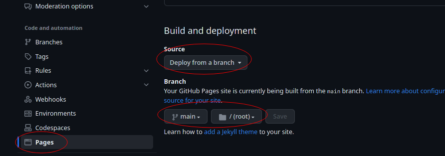

# Jekyll
Jekyll is the default static site generator used by github pages to render repo markdown as html.

[This very minimal repo](//github.com/lncd/lncd.github.io) is a good demo of using `remote_theme:` setting in [`_config.yml`](https://github.com/lncd/lncd.github.io/blob/main/_config.yml) for beautifying default github page themes.

## Github Pages
The only requirements to sprucing up your `account.github.io` repository is a [`_config.yml`](https://github.com/lncd/lncd.github.io/blob/main/_config.yml) file at the root level with the default page settings "deploy from main branch root".




### [`_config.yml`](https://github.com/lncd/lncd.github.io/blob/main/_config.yml)
```
title: LNCD
description: Laboratory of Neuro-Cognitive Development
url: "https://lncd.github.io/"
remote_theme: just-the-docs/just-the-docs
```

## Local Development
Only `_config.yml` is need to change how github pages themes the markdown content.
But running locally can be useful for testing out themes and markdown formatting.

 * [`Makefile`](https://github.com/lncd/lncd.github.io/blob/main/Makefile) records commands (recipes) for serving the site locally. 
 * [`Gemfile`](https://github.com/lncd/lncd.github.io/blob/main/Gemfie) lists the ruby packages needed.

The meat of the Makefile is simply `bundle exec jekyll serve`

### Mac OS
For make to work, you'll need `ruby`. get it with [homebrew](https://brew.sh/)'s `brew` command

```
brew install ruby
```

if `brew: command not found` get homebrew first
```
/bin/bash -c "$(curl -fsSL https://raw.githubusercontent.com/Homebrew/install/HEAD/install.sh)"
```

## Tree
```
lncd.github.io/
├── colophon.md  # this page
├── _config.yml  # where the theme is set (remote_theme: just-the-docs/just-the-docs)
├── Gemfile      # ruby libaries needed for serving/testing jekyll on locally
├── index.md     # landing page
└── Makefile     # recipies for "make" to bundle ruby gems and serve jekyll locally
```

## Alternatives
 * `mkdocs-material` is specialized for code documentation. It has more features with simpler configuration for it's use case. `mkdocs gh-deploy` writes the static site to a separate github branch (requires changing github page settings). 
 * `hugo` is fast and has a more robust theme (sub-folder) mechanism. GitHub Actions are the preferred deployment method.
 * `dokuwiki` is not a static generator (requires php host). Wiki pages are edited dynamically and user accounts allow for private pages and finer access control
 * `wordpress` is also dynamic and requires a php host. It provides what-you-see-is-what-you-get editing and website/GUI driven settings and theme selection
